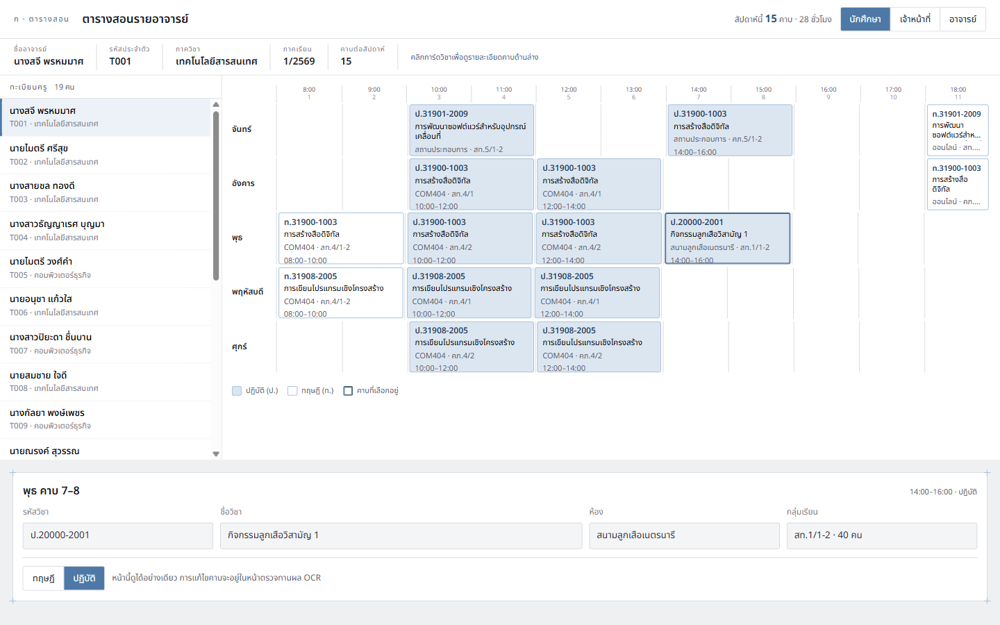

# AI Chat ตารางสอนอาจารย์ (Timetable Assistant)

เจ้าหน้าที่อัปโหลดไฟล์ตารางสอน → OCR ภาษาไทย → ข้อมูลเชิงสัมพันธ์ → นักศึกษาถามเป็นภาษาพูดผ่านแชท
แผนงานฉบับเต็มอยู่ที่ [`docs/แผนงาน.md`](docs/แผนงาน.md)

## สถานะ

ทำเสร็จแล้วเฉพาะ **Slice 0 — ฐานราก**: Docker Compose + schema + ทะเบียนครู + ตอบตารางสอนจากฐานข้อมูล
ส่วน OCR pipeline, หน้าตรวจทาน, แชท และ frontend ยังไม่ได้ทำ (ดูหัวข้อ 13 ในแผนงาน)

| ส่วน | สถานะ |
|---|---|
| Postgres 16 + Flyway schema (7 ตาราง + view `v_teacher_schedule`) | เสร็จ |
| นำเข้าทะเบียนครูจาก CSV (`POST /teachers/import`) | เสร็จ |
| ตอบตารางสอนรายอาจารย์ (`GET /teachers/{id}/schedule`) | เสร็จ |
| หน้าเว็บดูตารางสอน + นำเข้าทะเบียนครู (FE-6 บางส่วน) | เสร็จ |
| OCR (BE-1..BE-5), หน้าตรวจทาน (BE-6..BE-8), แชท (BE-9, BE-10) | ยังไม่ทำ |

## รันระบบ

ต้องมี Docker Desktop เปิดอยู่ ไม่ต้องติดตั้ง Java หรือ Maven (ใช้ Maven Wrapper ใน image)

```bash
docker compose up -d --build       # backend + postgres
docker compose ps                  # ต้อง healthy ทั้งคู่

cd frontend && npm install && npm run dev   # หน้าเว็บที่ http://localhost:5273
```

พอร์ตของ Vite ถูกล็อกไว้ที่ 5273 ด้วย `strictPort` เพราะ backend อนุญาต CORS เฉพาะ origin นี้
ถ้าปล่อยให้ Vite ย้ายพอร์ตเองเมื่อชนกับโปรเจกต์อื่น หน้าเว็บจะเรียก API ไม่ได้แบบเงียบ ๆ

พอร์ตบนเครื่องใช้ **8081** (backend) และ **5433** (postgres) เพราะ 8080/5432 มักถูกโปรเจกต์อื่นจองไว้
ในเน็ตเวิร์กของ compose ยังคุยกันที่ 8080/5432 ตามเดิม

## หน้าเว็บ



ธีมถอดมาจากต้นแบบ `docs/OCR Review - Split.dc (1).html` แล้วใช้เป็นธีมกลางของทุกหน้า
กติกาและ token ทั้งหมดอยู่ใน [`docs/style-guide.md`](docs/style-guide.md) โค้ดอยู่ที่ `frontend/src/theme.css`

ตารางเป็นกริดวันคูณคาบเหมือนตารางที่พิมพ์จากงานทะเบียน คาบปฏิบัติเป็นการ์ดพื้นฟ้าและรหัสขึ้นต้นด้วย `ป.`
คาบทฤษฎีเป็นการ์ดพื้นขาวขึ้นต้นด้วย `ท.` — สื่อสองทางเสมอเพื่อให้คนตาบอดสียังอ่านได้
คลิกการ์ดแล้วรายละเอียดคาบขึ้นในพาเนลด้านล่าง ปุ่มสลับบทบาทมุมขวาบนใช้ token ของโปรไฟล์ dev

## ทดลองใช้ผ่าน API

token ของโปรไฟล์ dev มี 3 ตัว: `dev-staff` · `dev-teacher` · `dev-student`
เป็นของปลอมสำหรับสาธิตเท่านั้น โปรไฟล์ prod ไม่มี token ใด ๆ จนกว่าจะต่อ SSO จริง (ทุก request จะโดน 401)

```bash
# ไม่แนบ token -> 401 application/problem+json
curl -i http://localhost:8081/api/v1/teachers

# นำเข้าทะเบียนครู (ต้องเป็น staff) -> inserted 18, rejected 1 แถวที่ไม่มีรหัส
curl -H "Authorization: Bearer dev-staff" \
     -F "file=@docs/teachers-sample.csv" \
     http://localhost:8081/api/v1/teachers/import

# บทบาทไม่พอ -> 403
curl -H "Authorization: Bearer dev-student" \
     -F "file=@docs/teachers-sample.csv" \
     http://localhost:8081/api/v1/teachers/import

# ตารางสอนของ อ.สจี 15 คาบ อ่านจาก view
curl -H "Authorization: Bearer dev-student" \
     http://localhost:8081/api/v1/teachers/1/schedule
```

ดูข้อมูลในฐานโดยตรง (ไม่ต้องมี psql บนเครื่อง):

```bash
docker compose exec db psql -U timetable -d timetable -c "select count(*) from session"
```

## ข้อมูลตัวอย่าง

`db/seed/R__seed_demo.sql` ถูก **generate จาก `dataset/schedule.json`** ไม่ได้พิมพ์มือ จึงตรงกับข้อมูลที่ใช้
สร้าง dataset ของโมเดลทุกช่อง ทำให้คำตอบจาก SQL กับจากโมเดลเทียบกันได้ ซึ่งเป็นฐานของ verification (BE-10)

seed โหลดเฉพาะโปรไฟล์ `dev` — โปรไฟล์ prod ไม่สแกนโฟลเดอร์ `db/seed` เลย

## โครงสร้าง

```
backend/    Spring Boot 4.0.8 (Java 21) — REST API
frontend/   React 18 + Vite (ยังว่าง)
dataset/    schedule.json + Q&A jsonl สำหรับ fine-tune
docs/       แผนงาน + spec + CSV ทะเบียนครูตัวอย่าง
notebook2d9739102c.ipynb   LoRA fine-tune Qwen2.5-1.5B (รันบน Kaggle)
```
